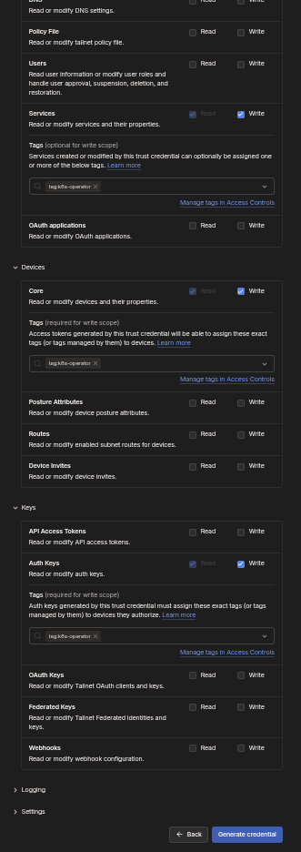

# Homelab

One K3s control plane, one media worker, and FluxCD deploying media apps from a
public GHCR OCI artifact.

## The simple picture

```text
archbtw                       media-worker
K3s API + datastore           Kubernetes Pods
no application Pods           Immich + PostgreSQL + monitoring
        |                             ^
        +---------- schedules --------+

GitHub push -> ghcr.io/bupd/homelab/cluster:latest -> Flux -> cluster
```

Flux is installed once in the cluster. Do not install Flux on every worker.
When another worker joins K3s, the existing Flux controllers can manage it.

## Before you start

Run these steps on `archbtw` from the repository root unless a step says
otherwise.

You need:

- Arch Linux with a working NVIDIA driver;
- the media disk with UUID `ACCA4642CA460952` attached;
- this repository checked out;
- permission to push to `bupd/homelab`; and
- the GHCR package `ghcr.io/bupd/homelab/cluster` set to public;
- MagicDNS and HTTPS enabled for the Tailscale tailnet; and
- a Tailscale OAuth client for the Kubernetes Operator.

Install the host tools:

```bash
sudo pacman -S --needed curl podman nvidia-container-toolkit
brew install just
```

Check them:

```bash
podman info
nvidia-smi
nvidia-ctk --version
just --version
```

`just` is the only project command runner. It builds a pinned tool container
for Flux, Helm, kubectl, and yq. Those tools do not need to be installed on the
host.

## Fresh install: do these steps in order

### 1. Check the machine and disk

The checked-in addresses and disk UUID are specific to this homelab. Confirm
them before installing anything:

```bash
ip address show
lsblk -f
grep -v '^#' hosts/homelab/k3s-agents/media-worker/media-worker.fstab
```

Expected control-plane LAN address: `192.168.0.4`.

Create the mount point. The worker reconciler installs the persistent mount:

```bash
sudo install -d -m 0755 /home/bupd/hdd/data
```

Stop here if the address or disk UUID is wrong. Fix the checked-in files first.

### 2. Create the K3s cluster

Install the declared server configuration before K3s starts:

```bash
sudo install -d -m 0755 /etc/rancher/k3s
sudo install -m 0600 hosts/homelab/k3s/config.yaml /etc/rancher/k3s/config.yaml
sudo install -m 0644 hosts/homelab/k3s/modules-load.conf /etc/modules-load.d/k3s.conf
sudo install -m 0644 hosts/homelab/k3s/sysctl.conf /etc/sysctl.d/90-k3s.conf
sudo modprobe overlay
sudo modprobe br_netfilter
sudo sysctl --system
```

Install the pinned K3s release:

```bash
curl -sfL https://get.k3s.io \
  | sudo env INSTALL_K3S_VERSION='v1.36.2+k3s1' sh -
```

Check the control plane:

```bash
sudo systemctl status k3s --no-pager
sudo k3s kubectl get --raw=/readyz
```

`kubectl get nodes` can be empty at this point. The server is agentless and is
not a Kubernetes worker.

### 3. Create and join `media-worker`

Run the host reconciler:

```bash
sudo hosts/homelab/k3s-agents/media-worker/reconcile.sh
```

It mounts the HDD, creates the Podman K3s agent, copies the private K3s token,
joins the worker, applies its labels, moves system Pods to it, and verifies the
GPU and storage mounts.

Check the result:

```bash
sudo k3s kubectl get nodes -o wide
sudo k3s kubectl get pods -A -o wide
sudo podman ps --filter name=media-worker
```

Expected result: the only Kubernetes Node is `media-worker`, and it is `Ready`.
`archbtw` must not appear as a Node.

### 4. Create the local kubeconfig

The Just recipes expect `$HOME/.kube/k3s.kubeconfig.yaml` and context
`homelab`:

```bash
install -d -m 0700 "$HOME/.kube"
sudo cp /etc/rancher/k3s/k3s.yaml "$HOME/.kube/k3s.kubeconfig.yaml"
sudo chown "$(id -u):$(id -g)" "$HOME/.kube/k3s.kubeconfig.yaml"
chmod 0600 "$HOME/.kube/k3s.kubeconfig.yaml"
export KUBECONFIG="$HOME/.kube/k3s.kubeconfig.yaml"
kubectl config rename-context default homelab
kubectl config use-context homelab
kubectl get nodes
```

If the context is already named `homelab`, skip the `rename-context` command.
Never commit this file. It is a cluster-admin credential.

### 5. Build and publish one rollout layer

Validate all Kustomizations, YAML, and pinned Helm charts locally:

```bash
just validate
```

Artifact selection follows one direction only:

```text
cluster -> platform -> apps
```

Selecting `cluster` contains cluster policy only. Selecting `platform` adds
every platform component but no application. Selecting an app adds its required
cluster and platform dependencies. With no scope, the enabled entries in
`clusters/homelab/cluster/kustomization.yaml` are selected. The initial enabled
graph is controlled entirely by that Kustomization.
Artifact scopes can narrow the enabled graph, but cannot bypass a commented-out
entry. Uncomment the CloudNativePG and Immich lines in the cluster
Kustomization before selecting `apps/media`.

Build the complete currently enabled graph locally:

```bash
just build-artifact
```

The result is `dist/homelab-cluster.tgz`. Building does not push anything and
does not contact Kubernetes. Other examples:

```bash
just build-artifact cluster
just build-artifact platform
just build-artifact apps/media
just build-artifact --ignore apps
just build-artifact platform --ignore platform/controllers
just build-artifact
```

An explicit ignore cannot remove a dependency required by the selected scope;
the build fails instead of producing a broken Flux graph.

Push the complete currently enabled graph manually:

```bash
GHCR_USERNAME=bupd \
GHCR_TOKEN='<GitHub token with write:packages>' \
just push-artifact
```

This publishes an immutable revision and moves the public `latest` tag consumed
by Flux. Pushing the artifact does not install or bootstrap Flux by itself.

The GitHub Actions workflow uses the same no-scope `just push-artifact` command,
so the published artifact always matches the enabled root graph. Push or merge
the repository branch:

```bash
git push origin HEAD
```

Merge that branch into `main`. GitHub Actions validates the repository,
publishes an immutable commit-tagged artifact, and moves
`ghcr.io/bupd/homelab/cluster:latest` to that artifact. Wait for the `Publish
homelab cluster artifact` workflow on `main` to succeed before continuing.

Flux pulls the public artifact anonymously. No GHCR pull Secret is needed.

### 6. Install Flux and its SOPS key once

```bash
export KUBECONFIG="$HOME/.kube/k3s.kubeconfig.yaml"
just flux-install
just flux-sops-key
```

This installs the Flux CRDs and controllers, then copies the local Age identity
from `~/.config/sops/age/keys.txt` into the `flux-system/sops-age` bootstrap
Secret. The private key is never placed in GHCR. Check Flux:

```bash
kubectl -n flux-system get pods -o wide
```

All Flux Pods should become `Running` on `media-worker`.

### 7. Set the Tailscale Operator credential through SOPS

In the Tailscale policy, make `tag:k8s-operator` an owner of `tag:k8s`. Create
an OAuth client with Devices Core, Auth Keys, and Services write scopes, tagged
`tag:k8s-operator`.

Open the
[Tailscale Trust Credentials page](https://console.tailscale.com/admin/settings/trust-credentials/add),
choose **OAuth**, and match these scopes and tags:



The repository contains an encrypted placeholder Secret. Decrypt it locally:

```bash
just decrypt
```

This decrypts every repository-managed Secret into a gitignored sibling
`*.dec.yaml` file. Edit
`platform/networking/tailscale-operator/operator-oauth.dec.yaml` and replace both
`REPLACE_ME` values with the generated client ID and client secret. Seal all
decrypted files again immediately:

```bash
just encrypt
just validate
```

The plaintext copy is removed after encryption. Flux decrypts and creates
`tailscale/operator-oauth` before the Helm controller installs the operator; no
manual `kubectl create secret` command is needed. The Grafana administrator
Secret works the same way. See [Secrets with SOPS and Age](docs/secrets.md).

### 8. Point Flux at the cluster artifact

```bash
just flux-bootstrap
just flux-reconcile
just flux-status
```

The currently enabled graph follows this dependency chain:

```text
node policy
  -> Tailscale Operator
  -> kube-prometheus-stack
  -> CloudNativePG operator
  -> NVIDIA GPU Operator
  -> HAMi GPU virtualization
  -> Immich database
  -> Immich
```

Flux checks the public `latest` OCI artifact every two minutes. Every successful
workflow publication creates an immutable commit tag and moves `latest`, so a
push from any branch can update the desired state consumed by the cluster.

To publish only the media layer and its required dependencies manually:

```bash
GHCR_USERNAME=bupd \
GHCR_TOKEN='<GitHub token with write:packages>' \
just push-artifact apps/media
```

The `apps/media` scope carries the required platform automatically, then adds
CloudNativePG, the Immich database, Immich, and its metrics resources.

### 9. Check Prometheus and Grafana

```bash
kubectl -n observability get pods,pvc,ingress
kubectl -n observability get prometheus,alertmanager
```

Prometheus is private at <https://prometheus.tail6c5ea9.ts.net>. Open its
`/targets` page and confirm the Kubernetes, worker, CloudNativePG, and Immich
targets are healthy. Prometheus has no application-level login, so restrict
access to its Tailscale proxy with tailnet ACLs.

Grafana is private at <https://grafana.tail6c5ea9.ts.net>. Retrieve its
SOPS-managed password:

```bash
kubectl -n observability get secret grafana-admin \
  -o jsonpath='{.data.admin-password}' | base64 --decode
printf '\n'
```

The monitoring stack is cluster-wide. Prometheus is the central collector,
kube-state-metrics observes Kubernetes objects, and node-exporter runs as a
DaemonSet on every current and future schedulable worker.

### 10. Check Immich

```bash
kubectl -n immich get pods,pvc
kubectl -n immich get clusters.postgresql.cnpg.io,databases.postgresql.cnpg.io
kubectl -n immich get helmrelease,ocirepository
kubectl -n immich rollout status deployment/immich-server --timeout=15m
kubectl -n immich get ingress immich
kubectl get node media-worker \
  -o jsonpath='{.status.allocatable.nvidia\.com/gpu}{" HAMi vGPU slots\n"}'
```

Immich is private at <https://immich.tail6c5ea9.ts.net>. For recovery before
Tailscale ingress is healthy, use a temporary local tunnel:

```bash
kubectl -n immich port-forward service/immich-server 2283:2283
```

Open <http://127.0.0.1:2283>.

Do not create a new admin account if restoring the existing library. Follow
[Immich backup and restore](apps/media/immich/README.md#backup-and-restore) to
restore the existing database, verify the photos, and enable scheduled
backups.

## Normal daily operation

Change manifests, validate, then push to `main`:

```bash
just validate
git add --all
git commit -m 'describe the cluster change'
git push origin main
```

Watch reconciliation:

```bash
just flux-status
```

Do not fix managed resources with `kubectl edit`. Flux will revert the change.
Edit this repository and publish a new artifact.

## Add another worker later

Flux does not join machines to Kubernetes. First install and join a K3s agent
using the server address `https://192.168.0.4:6443` and the private token at
`/var/lib/rancher/k3s/server/node-token`.

After the Node is `Ready`:

1. Add `clusters/homelab/nodes/<node-name>/node-policy.yaml`.
2. Add that file to `clusters/homelab/nodes/kustomization.yaml`.
3. Add node selectors or affinity only to workloads intended for that node.
4. Run `just validate`, commit, and push to `main`.

Do not install another copy of Flux on the worker.

## Where things live

```text
hosts/homelab/             host bootstrap, K3s server, worker definition
clusters/homelab/          Flux installation and cluster reconciliation graph
platform/controllers/      shared operators such as CloudNativePG
platform/networking/       Tailscale Operator and private ingress platform
platform/observability/    cluster-wide Prometheus, Alertmanager, and Grafana
apps/media/immich/         Immich, its database, values, storage, and backups
tools/ci/                   pinned containerized GitOps tools
```

Storage rules:

- Immich-managed assets: `/home/bupd/hdd/data/immich/library`
- Existing external media: `/home/bupd/hdd/data/BUPD_Personal`
- Immich database: K3s `local-path` storage on the Linux filesystem
- Logical database dumps: `/home/bupd/hdd/data/immich/backups`
- Never put a live PostgreSQL data directory on the NTFS media disk
- Host-path storage requires hard node affinity to `media-worker`

More detail:

- [Host configuration](hosts/homelab/README.md)
- [Cluster reconciliation](clusters/homelab/README.md)
- [Immich operation and recovery](apps/media/immich/README.md)
- [Architecture and rollout decisions](docs/architecture-plan.md)
- [Private networking policy](docs/networking.md)
- [Secrets with SOPS and Age](docs/secrets.md)
