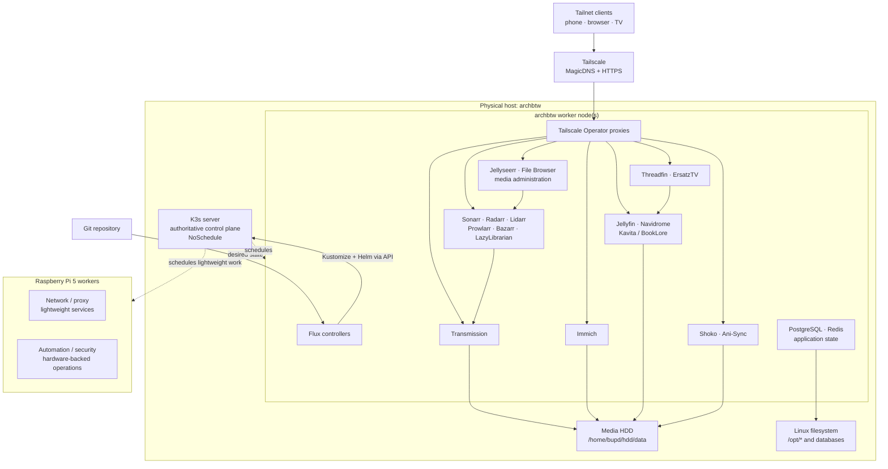

# Homelab architecture and rollout plan

## Goal

Build `ins1` as a private, declarative media and personal-services cluster. The
physical `archbtw` machine remains the authoritative K3s control plane and also
hosts separately registered worker nodes for the storage- and compute-heavy
media stack. Raspberry Pi workers provide lightweight network, security, and
automation capacity.

Kubernetes objects are reconciled by Flux. Applications and infrastructure
add-ons are installed with pinned Helm releases. Host bootstrap remains under
`hosts/`; credentials are encrypted before they enter Git. Docker Compose and
manual application deployments are outside the target operating model.

## Target architecture



The diagram describes logical ownership, not a promise that every component is
present on day one. The exact way the `archbtw` worker nodes are created is a
host-bootstrap concern and is deliberately left open until those nodes exist.

## Node roles and scheduling

| Node class | Intended work | Required policy |
| --- | --- | --- |
| `archbtw` K3s server | API server, datastore, built-in control-plane components | Permanent `NoSchedule` control-plane taint |
| `archbtw` worker | Media, databases, downloads, image processing, transcoding | Label as media/compute/storage capable; attach or mount the media storage here |
| Raspberry Pi worker | Network, proxy, monitoring, security, small automation | ARM64-compatible images and conservative requests/limits |

Application releases must select a node class intentionally. Heavy releases
must not fall back to the Raspberry Pis, and no application may tolerate the
control-plane taint merely to make scheduling succeed.

Suggested label contract for the future workers:

```text
homelab.bupd.dev/node-class=media-worker
homelab.bupd.dev/storage=media
homelab.bupd.dev/accelerator=<none|intel|amd|nvidia>
```

Pi workers should use `homelab.bupd.dev/node-class=edge-worker`. Actual node
names and accelerator labels are added only after the nodes have registered.

## Network and service identities

The LAN is the K3s underlay. Tailscale is the only user access plane. Services
use their own tailnet-only HTTPS names and must never advertise `192.168.0.4`
as an external URL.

| Purpose | Identity |
| --- | --- |
| Kubernetes API | `https://archbtw.tail6c5ea9.ts.net:6443` |
| Photos | `https://immich.tail6c5ea9.ts.net` |
| Video, anime, and live TV | `https://jellyfin.tail6c5ea9.ts.net` |
| Music | `https://navidrome.tail6c5ea9.ts.net` |
| Books | `https://kavita.tail6c5ea9.ts.net` or `https://booklore.tail6c5ea9.ts.net` |
| Arr and supporting UIs | `https://<service>.tail6c5ea9.ts.net` |

The Tailscale Kubernetes Operator supplies the ingress proxies and certificates.
Funnel, public load balancers, public DNS, router port forwards, and public
NodePorts are prohibited. Internal calls use Kubernetes Service DNS. The full
contract is in [Private networking](networking.md).

## Storage and data flow

The media disk and fast application state have different reliability and
filesystem requirements:

| Data | Target | Notes |
| --- | --- | --- |
| Photos, video, music, books | `/home/bupd/hdd/data` | Bulk library data on the mounted HDD |
| Completed/incomplete downloads | `/home/bupd/hdd/data/downloads` | Same filesystem as media where possible, enabling atomic moves/hardlinks |
| Application configuration | `/opt/<service>` | Linux filesystem owned by the relevant worker |
| PostgreSQL, Redis, indexes | Fast Linux filesystem | Never store databases on NTFS |
| Git-managed configuration | This repository | No runtime data or plaintext secrets |

Recommended library layout:

```text
/home/bupd/hdd/data/
  downloads/
    incomplete/
    complete/
  media/
    movies/
    tv/
    anime/
    music/
    books/
    audiobooks/
  photos/
    library/
    uploads/
```

The storage implementation must be selected before application deployment.
The preferred result is a stable StorageClass or explicit PersistentVolumes
backed by storage mounted on an `archbtw` media worker. Direct `hostPath`
volumes are acceptable only when a release has hard node affinity and the
single-node failure/recovery behavior is documented.

## Service model

### Photos

- Immich is the photo and video library.
- PostgreSQL and Redis use the fast Linux filesystem.
- Originals and uploads use the media HDD.
- Database and configuration backups are independent from the media library.

### Movies, television, and downloads

- Jellyfin is the single video consumption interface.
- Sonarr manages standard TV and anime with separate root folders, tags, and
  quality profiles. Rick and Morty belongs in `media/tv`; anime belongs in
  `media/anime`.
- Radarr manages movies, Lidarr manages music, Bazarr manages subtitles, and
  Prowlarr supplies indexer configuration to the Arr applications.
- Transmission is the download client. Its network policy permits only the
  flows needed from the managers and approved external endpoints.
- File Browser provides explicitly scoped media-file administration; it must
  not receive unrestricted access to application state or cluster credentials.
- Jellyseerr may provide requests. Recyclarr, Unpackerr, and Maintainerr are
  later automation layers, not bootstrap dependencies.

### Anime and AniList

- Shoko indexes only the anime library and Shokofin connects it to Jellyfin.
- A persistent Ani-Sync deployment records per-user Jellyfin progress in
  AniList. Its OAuth credentials and state must survive Pod replacement.
- Anime metadata ownership must be unambiguous; avoid running competing
  Jellyfin metadata providers against the same library.

### Live and personal television

- An authorized M3U/XMLTV provider or physical tuner feeds Threadfin.
- Threadfin filters channels, maps guide data, and supplies Jellyfin Live TV.
- ErsatzTV creates personal linear channels from locally owned media, such as
  an anime channel or a continuous Rick and Morty channel.
- Threadfin and ErsatzTV administration can remain cluster-internal unless a
  dedicated tailnet UI is required.
- DRM bypasses and unlicensed public IPTV playlists are out of scope.

### Music and books

- Navidrome serves the MP3 library through its web UI and OpenSubsonic clients.
- LazyLibrarian handles book acquisition; Kavita or BookLore maintains and
  presents the local EPUB/PDF library. Audiobookshelf is optional for spoken
  books.
- A future Play Books outbox may normalize EPUB metadata and covers and place
  upload-ready files in an export directory. Upload to Google Play Books
  remains a deliberate user action unless Google provides a supported personal
  library upload API.

## Declarative repository shape

The target layout is:

```text
clusters/ins1/
  flux-system/                 # Generated Flux bootstrap manifests
  infrastructure/
    controllers/               # Operators and cluster-wide controllers
    configs/                   # Storage, ingress, policies, observability
  apps/
    media/                     # Jellyfin, Arr stack, Transmission, anime, TV
    photos/                    # Immich and dependencies
    books/                     # LazyLibrarian and reader services
  nodes/                       # Labels and taints for registered nodes
hosts/instance1/               # Host bootstrap, K3s, mounts, worker definitions
docs/                          # Architecture, operations, recovery, decisions
```

Each deployable component should have a Flux `HelmRepository` or OCI source, a
pinned `HelmRelease`, values kept beside the release, an explicit namespace,
resource requests/limits, health checks, storage, placement, and private ingress.
Use SOPS with age for secrets. Keep one Kustomization per dependency boundary
so Flux can order controllers, infrastructure configuration, and applications.

## Rollout plan

### Phase 0 — Protect the foundation

1. Confirm the HDD UUID mount and directory ownership after a reboot.
2. Install the checked-in K3s server configuration on `archbtw` and verify the
   control-plane taint, API SANs, and disabled packaged ingress components.
3. Back up the K3s datastore/token and document restore commands.

Exit gate: `archbtw` is reachable over LAN and tailnet, the API certificate is
valid for its declared names, and no ordinary Pod can schedule there.

### Phase 1 — Add workload capacity

1. Create and join the separate `archbtw` worker node or nodes.
2. Attach/mount the HDD and fast application-state filesystem to the intended
   media worker.
3. Add declarative labels, placement rules, and resource reservations.
4. Join the Raspberry Pis as agent-only edge workers when ready.

Exit gate: a test Pod can use persistent media and fast-state volumes on the
media worker, and cannot land on the control plane or an unsuitable Pi.

### Phase 2 — Bootstrap GitOps and private ingress

1. Bootstrap Flux against this branch and cluster path.
2. Configure SOPS/age secret decryption and recovery-key handling.
3. Install the Tailscale Kubernetes Operator through a pinned Helm release.
4. Validate a disposable private HTTPS service from a tailnet client.

Exit gate: a Git commit creates, updates, and removes the test service without
manual in-cluster edits, and the service is unreachable outside the tailnet.

### Phase 3 — Establish storage, backup, and policy

1. Declare the selected StorageClasses/PersistentVolumes and snapshot or backup
   jobs.
2. Apply default-deny NetworkPolicies with explicit DNS, ingress, database, and
   download egress allowances.
3. Add baseline metrics, logs, disk-capacity alerts, and certificate checks.
4. Perform a restore drill for one disposable database and one configuration
   volume.

Exit gate: storage survives Pod replacement, backups are restorable, and disk
or workload failures generate actionable alerts.

### Phase 4 — Deploy Immich first

1. Deploy PostgreSQL/Redis and Immich with pinned versions and explicit
   resources.
2. Mount photo originals/uploads and keep database state off NTFS.
3. Expose only `immich.tail6c5ea9.ts.net` and configure that exact external URL.
4. Test upload, thumbnail generation, restart, upgrade, backup, and restore.

Exit gate: Immich works from multiple tailnet clients and passes a restore test.

### Phase 5 — Deploy the core media pipeline

1. Deploy Transmission and Prowlarr.
2. Deploy Sonarr, Radarr, Bazarr, and optionally Lidarr with consistent paths.
3. Deploy Jellyfin last so it consumes a stable, correctly permissioned library.
4. Configure hardware transcoding only after the worker exposes a supported GPU.

Exit gate: an approved test item moves through request/acquisition, import,
metadata/subtitles, and playback without manual path repair.

### Phase 6 — Add anime, live TV, music, and books

1. Add Shoko/Shokofin and Ani-Sync; verify AniList per-user OAuth and scrobbling.
2. Add Threadfin only after an authorized channel and guide source is available.
3. Add ErsatzTV for local-media channels.
4. Add Navidrome, LazyLibrarian, and one primary book reader.

Exit gate: each feature has a named owner, persistent state, backup coverage,
private URL where needed, and a documented recovery check.

### Phase 7 — Harden and automate operations

1. Add Jellyseerr, Recyclarr, Unpackerr, and Maintainerr where they remove a
   demonstrated manual step.
2. Add image update reporting; upgrades remain pull-request-driven and pinned.
3. Define maintenance windows, disruption budgets, retention, and capacity
   thresholds.
4. Write runbooks for failed workers, lost disks, control-plane restore, key
   rotation, and tailnet lockout.

Exit gate: a fresh operator can diagnose and recover the documented failure
cases from Git and backups without relying on undocumented cluster state.

## Production-readiness standard

This homelab is production-like, but a single authoritative control plane and
single media disk are intentional single points of failure. Declarative GitOps
does not by itself provide availability or backup.

A service is considered ready only when all of the following are true:

- version and configuration are pinned in Git;
- secrets are encrypted and recoverable;
- scheduling and architecture compatibility are explicit;
- CPU/memory requests and limits are set from observed use;
- persistent data location, ownership, backup, and restore are tested;
- health probes and dependency ordering are defined;
- ingress is tailnet-only and the external URL is correct;
- NetworkPolicy and least-privilege service-account behavior are reviewed;
- upgrade and rollback procedures are documented;
- monitoring covers availability, storage capacity, and backup freshness.

## Decisions still required

These choices block the corresponding rollout phase but not repository design:

1. How the separate `archbtw` worker nodes are created and named.
2. Which worker owns the HDD and whether Kubernetes consumes it through local
   persistent volumes, NFS, or a CSI implementation.
3. Which GPU, if any, is exposed for Jellyfin transcoding and Immich acceleration.
4. Backup destination separate from the media disk.
5. Primary book UI: Kavita or BookLore.
6. Authorized Tamil/English live-TV source or physical tuner.
